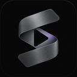
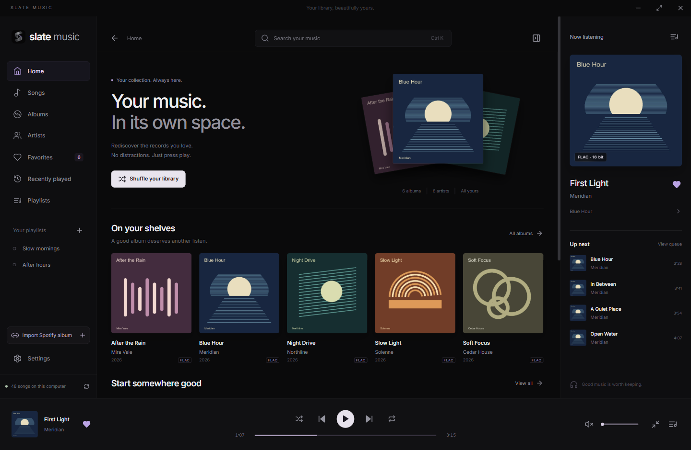
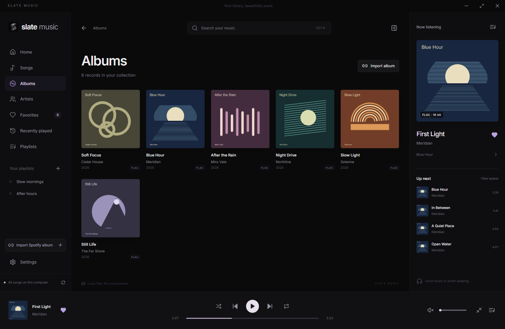
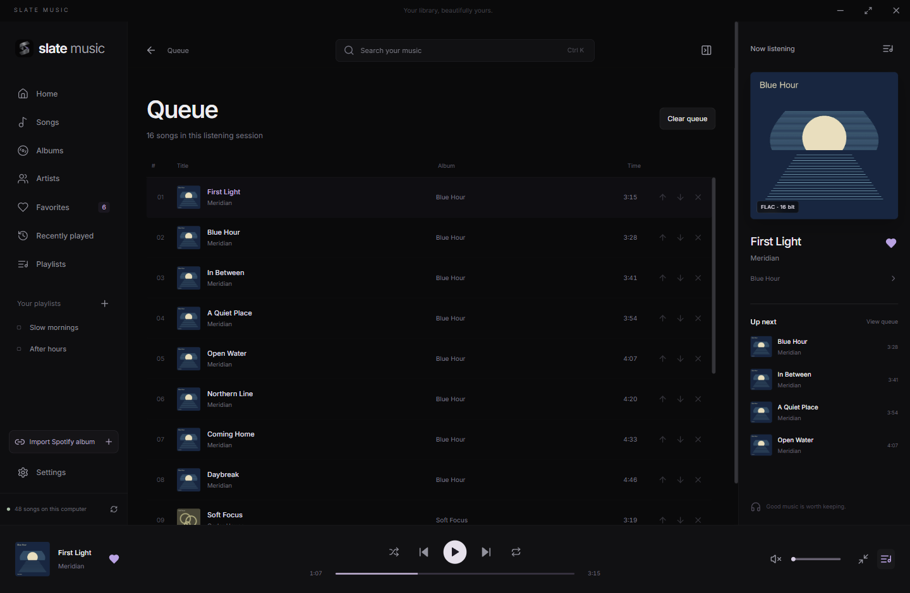

<p align="center"><a href="https://SPARTANAC95.github.io/slate-music/"></a></p>
<h1 align="center">SLATE MUSIC</h1>
<p align="center"><strong>Your music. In its own space.</strong><br>A beautiful, offline home for your local music collection.</p>
<p align="center"><a href="https://SPARTANAC95.github.io/slate-music/">Explore the website</a> &nbsp; / &nbsp; <a href="https://github.com/SPARTANAC95/slate-music/releases/latest">Download for Windows</a> &nbsp; / &nbsp; <a href="docs/GUIDE.md">User guide</a></p>
<p align="center"><a href="https://github.com/SPARTANAC95/slate-music/actions/workflows/ci.yml"></a> <a href="https://github.com/SPARTANAC95/slate-music/releases/latest"></a> <a href="LICENSE"></a></p>

[](https://SPARTANAC95.github.io/slate-music/)
<p align="center"><sub>Actual Windows app. Original demo artwork and synthetic files; no personal collection or music is included.</sub></p>

## A player for the records you keep

Slate Music gives your albums room to breathe. Browse the artwork, find the song you forgot you loved, and build a listening session that is still there when you return.

- **Your collection, organized.** Albums, artists, songs, playlists, favorites, recently played and an editable queue. Fast search, sorting, filtering and multidisc ordering.
- **Listening comes first.** Native gapless playback, optional 2–12 second crossfade, seeking, shuffle, repeat, keyboard shortcuts, a mini-player and Windows media controls.
- **A session that stays with you.** Queue, position, playlists, favorites, history and settings persist. The app always restores paused.
- **Your files stay yours.** Read-only indexing, watched folders, incremental rescans and cached artwork. No retagging, renaming, moving or deleting your music.
- **Offline by design.** Local playback and library management work offline. No Slate account, subscription or analytics.
- **Spotify albums, matched locally.** Retrieve an album’s ordered metadata and match recordings you already own. Review uncertain versions and save a virtual album or playlist.

## Get listening

**[Download the Windows installer](https://github.com/SPARTANAC95/slate-music/releases/latest)**

1. Run the installer and open **Slate Music** from the Windows Start menu.
2. Choose your music folder. Slate indexes its tags and album artwork.
3. Pick an album, build a playlist, or shuffle your library.

Windows 10/11 **x64**, WebView2 and an audio output are required. WebView2 is usually present; installing it on a new PC may need internet. The installer currently has no Windows Authenticode publisher certificate, so Windows may show an unknown-publisher warning. Download from the official release above.

Updates are cryptographically verified and download automatically by default. Installation waits for confirmation while paused or your choice to install on exit. Both automatic checks and downloads can be disabled.

## A closer look

| Your albums | Your listening queue |
|:---:|:---:|
| [](site/assets/player-albums.png) | [](site/assets/player-queue.png) |
| Artwork, album order and artist pages. | Reorder what comes next. Keep your place. |

Screenshots show a separate demo library in the real app. Click an image to view it at full size.

## Bring an album home from Spotify

Paste a Spotify album URL, review its local matches, and save the result in album order. Matching considers title, artist, duration and recording/version information. Missing tracks stay visible and never enter the playable queue. Uncertain matches can be corrected manually.

**This imports metadata, not Spotify audio.** No audio downloading, replacement downloads or DRM bypass. It requires your own Spotify developer app and an eligible Spotify account; no credentials are bundled.

[Connect Spotify and import your first album](docs/GUIDE.md#spotify-album-import)

## Audio, with the details included

| Supported and tested | Current output |
|---|---|
| FLAC, MP3, WAV, AAC/M4A, ALAC, Ogg Vorbis, AIFF | Windows default device, 48 kHz stereo |

Raw AAC has limited seeking support. Opus, WMA, APE, DSD and protected files are unsupported. Exclusive-mode and bit-perfect output are not available. [Read the audio notes](docs/GUIDE.md#audio-support).

## Built, run, and checked on Windows

Validation includes native playback and seeking, measured gapless sample continuity, queue behavior, restart recovery, folder changes, real Spotify matching, installer/reinstaller checks and a production **1.0.0 → 1.0.1** update retaining the library and paused session. Hosted Windows tests and signed installer verification also passed.

The [validation report](docs/VALIDATION.md) records the evidence and remaining limits. Test results describe what was checked, not a guarantee for every device or music file.

## Build it yourself

The app uses **Tauri 2, React, TypeScript, SQLite, Rodio and Symphonia**. Install Node.js 22+, stable Rust, Microsoft C++ Build Tools and the [Tauri Windows prerequisites](https://v2.tauri.app/start/prerequisites/).

```powershell
npm ci
npm run dev:app
```

```powershell
npm test
npm run build
npm run test:rust
```

The browser-only development page requires the native Tauri backend; it does not substitute a simulated library. Audio-fixture tests, isolated profiles, packaging and signing are explained in the guides below.

| Looking for | Start here |
|---|---|
| Shortcuts, playlists, folders, backups and Spotify setup | [User guide](docs/GUIDE.md) |
| The native engine, database and application structure | [Architecture](docs/ARCHITECTURE.md) |
| What was tested and what remains limited | [Validation](docs/VALIDATION.md) |
| Windows packaging, updater signing and publication | [Release engineering](docs/RELEASING.md) |
| Website, screenshots and public assets | [Presentation guide](docs/PRESENTATION.md) |
| Bugs, ideas and contributions | [Contributing](CONTRIBUTING.md) |
| What changed between releases | [Changelog](CHANGELOG.md) |

## Open source, in good company

Inspired by the visual language of [Slate](https://github.com/SPARTANAC95/slate). The reference repository was not modified. Built with Tauri, React, SQLite, Rodio/Symphonia, Lofty, notify, Souvlaki, Inter and Lucide. [Third-party credits](docs/THIRD_PARTY.md).

Created by [SPARTANAC95](https://github.com/SPARTANAC95). Released under the [MIT license](LICENSE).
