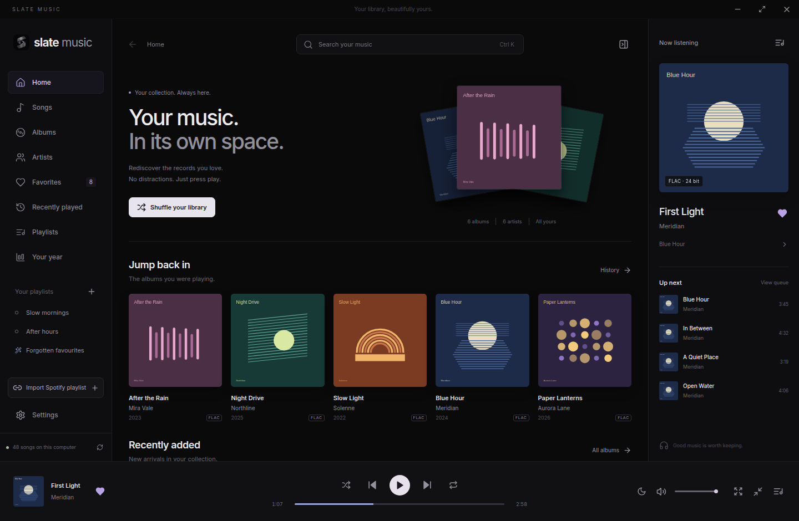
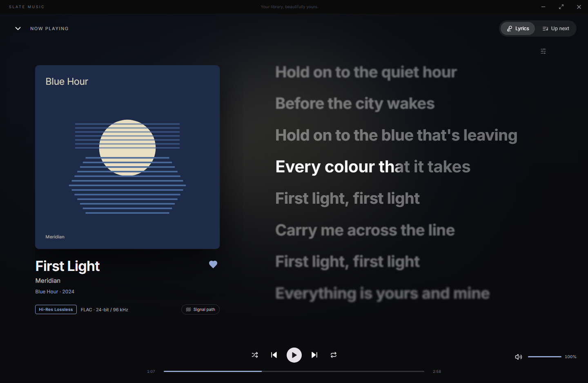
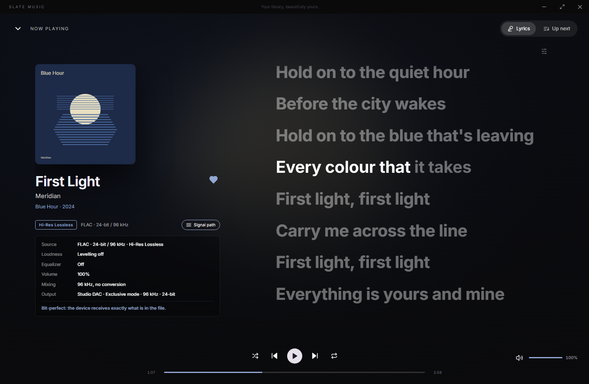
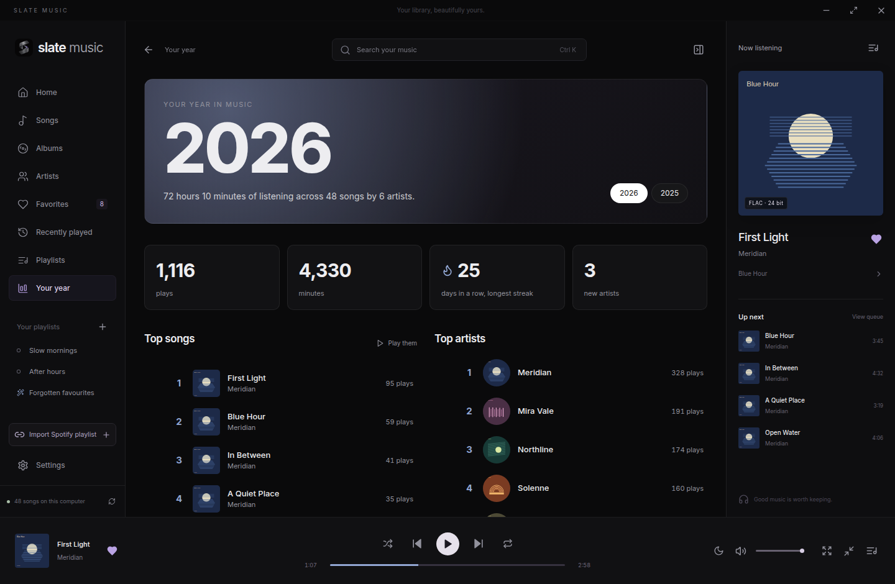
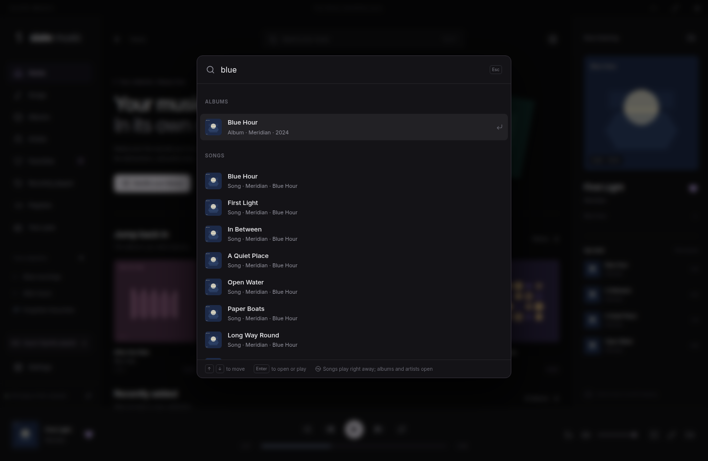

<p align="center"><a href="https://SPARTANAC95.github.io/slate-music/"></a></p>
<h1 align="center">SLATE MUSIC</h1>
<p align="center"><strong>Your music. In its own space.</strong><br>A beautiful, offline home for your local music collection, with synced lyrics, bit-perfect sound and your year in music.</p>
<p align="center"><a href="https://SPARTANAC95.github.io/slate-music/">Explore the website</a> &nbsp; / &nbsp; <a href="https://github.com/SPARTANAC95/slate-music/releases/latest">Download for Windows</a> &nbsp; / &nbsp; <a href="docs/GUIDE.md">User guide</a></p>
<p align="center"><a href="https://github.com/SPARTANAC95/slate-music/actions/workflows/ci.yml"></a> <a href="https://github.com/SPARTANAC95/slate-music/releases/latest"></a> <a href="LICENSE"></a></p>

[](https://SPARTANAC95.github.io/slate-music/)
<p align="center"><sub>The real interface with an original demo collection: fictional albums, songs, lyrics and artwork. No personal collection or music is included.</sub></p>

## A player for the records you keep

Slate Music gives your albums room to breathe. Browse the artwork, find the song you forgot you loved, and build a listening session that is still there when you return.

- **Your collection, organized.** Albums, artists, songs, playlists, favorites, recently played and an editable queue. Sortable columns, multidisc ordering, and a command bar (Ctrl+K) whose search forgives typos.
- **Now Playing.** A full-window view with a large, sharp cover, colours taken from it, and synced lyrics, lit word by word where the lyrics carry word times, from an .lrc file, the file's own tags or LRCLIB, a free lyrics database. Click a line to jump to it.
- **Sound you can trust.** Gapless playback, smart crossfades that skip silence and never fade within an album, loudness levelling (EBU R128 or ReplayGain) without clipping, a 10-band equalizer per output device, and an **exclusive mode** that sends each song bit-perfect at its own sample rate. The signal path shows every step.
- **Follows your headphones.** Choose an output device or follow Windows' default; plug headphones in or reconnect them and the music goes with them.
- **Your listening, looked after.** Home shelves (Jump back in, Recently added, On this day, Forgotten favourites), smart playlists built from rules, and **Your year**: plays, minutes, streaks and your top songs, artists and albums.
- **Hands on.** Pick several songs, drag them onto playlists or the queue, play next, a sleep timer, right-click menus, keyboard shortcuts, a mini-player, taskbar buttons and Windows media controls.
- **Share it, if you like.** Scrobble to Last.fm with your own API account, and show "Listening to Slate Music" on Discord, album cover included, with nothing to set up. Both are off until you switch them on.
- **Your files stay yours.** Read-only indexing, watched folders and cached artwork. Moved songs keep their favorites, plays and playlist places. No retagging, renaming, moving or deleting your music.
- **Offline by design.** Playback and library management work offline. No Slate account, subscription or analytics. Songs without lyrics of their own are looked up on LRCLIB unless you switch that off; the other online extras (original years, artist photos and bios, Spotify import, Last.fm, the Discord status) stay off until you turn them on.
- **Spotify playlists, matched locally.** Pick one of your Spotify playlists, Liked Songs or top songs and match them to recordings you already own. Review uncertain versions, save, and let it update itself.

## Get listening

**[Download the Windows installer](https://github.com/SPARTANAC95/slate-music/releases/latest)**

1. Run the installer and open **Slate Music** from the Windows Start menu.
2. Choose your music folder. Slate indexes its tags and album artwork.
3. Pick an album, build a playlist, or shuffle your library.

Windows 10/11 **x64**, WebView2 and an audio output are required. WebView2 is usually present; installing it on a new PC may need internet. The installer currently has no Windows Authenticode publisher certificate, so Windows may show an unknown-publisher warning. Download from the official release above.

Updates are cryptographically verified and download automatically by default. Installation waits for confirmation while paused or your choice to install on exit. Both automatic checks and downloads can be disabled.

## A closer look

| Now Playing, with synced lyrics | The signal path, bit-perfect |
|:---:|:---:|
| [](site/assets/player-now-playing.png) | [](site/assets/player-signal-path.png) |
| A big cover, its colours, and lyrics that follow along. | Every step from the file to the device. |
| **Your year** | **Command bar** |
| [](site/assets/player-year.png) | [](site/assets/player-command-bar.png) |
| Plays, streaks and favourites, worked out on your PC. | Songs, albums, artists and actions in one box. |

Screenshots show the real interface with a fictional demo library ([`tools/screenshots.mjs`](tools/screenshots.mjs)). Click an image to view it at full size.

## Bring a playlist home from Spotify

Choose one of your Spotify playlists (or paste its link), review the local matches, and save it in Spotify’s order. Matching considers title, artist, album, duration and recording/version information. Missing songs stay visible and never enter the playable queue. Uncertain matches can be corrected manually, and **Update from Spotify** picks up later changes while keeping your corrections.

**This imports metadata, not Spotify audio.** No audio downloading, replacement downloads or DRM bypass. It requires your own Spotify developer app and an eligible Spotify account; no credentials are bundled. Spotify only shares playlists you created or collaborate on.

[Connect Spotify and import your first playlist](docs/GUIDE.md#spotify-playlist-import)

## Audio, with the details included

| Supported and tested | Output |
|---|---|
| FLAC, MP3, WAV, AAC/M4A, ALAC, Ogg Vorbis, Opus, AIFF | Shared: through Windows at 48 kHz stereo, on the device you choose or Windows' default |
| | Exclusive (bit-perfect): each song at its own sample rate as 16- or 24-bit samples, with no Windows mixing or resampling |

Raw AAC has limited seeking support. WMA, APE, DSD and protected files are unsupported, and so are Opus files with more than two channels. Surround files are folded down to stereo. [Read the audio notes](docs/GUIDE.md#audio-support).

## Built, run, and checked on Windows

Version **1.1.0** was reviewed in full before release; all 33 review findings were fixed, and **1.1.1** added word-by-word lyrics and was run as a native app through every interface scenario. The automated checks (TypeScript tests and the native Rust tests, including the engine's gapless, crossfade, channel-order, exclusive-mode and device-switching logic) run on Windows in GitHub Actions, which also builds, signs and publishes each installer. Earlier releases verified real playback and seeking, measured gapless continuity, restart recovery and production upgrades **1.0.0 → 1.0.1 → 1.0.2**.

The [validation report](docs/VALIDATION.md) records the evidence and remaining limits. Test results describe what was checked, not a guarantee for every device or music file.

## Build it yourself

The app uses **Tauri 2, React, TypeScript, SQLite, Rodio and Symphonia**. Install Node.js 22+, stable Rust, Microsoft C++ Build Tools and the [Tauri Windows prerequisites](https://v2.tauri.app/start/prerequisites/).

```powershell
npm ci
npm run dev:app
```

```powershell
npm test
npm run build
npm run test:rust
```

The browser-only development page requires the native Tauri backend; it does not substitute a simulated library. Audio-fixture tests, isolated profiles, packaging and signing are explained in the guides below.

| Looking for | Start here |
|---|---|
| Shortcuts, playlists, folders, backups and Spotify setup | [User guide](docs/GUIDE.md) |
| The native engine, database and application structure | [Architecture](docs/ARCHITECTURE.md) |
| What was tested and what remains limited | [Validation](docs/VALIDATION.md) |
| Windows packaging, updater signing and publication | [Release engineering](docs/RELEASING.md) |
| Website, screenshots and public assets | [Presentation guide](docs/PRESENTATION.md) |
| Bugs, ideas and contributions | [Contributing](CONTRIBUTING.md) |
| What changed between releases | [Changelog](CHANGELOG.md) |

## Open source, in good company

Inspired by the visual language of [Slate](https://github.com/SPARTANAC95/slate). The reference repository was not modified. Built with Tauri, React, SQLite, Rodio/Symphonia, Lofty, notify, Souvlaki, Inter and Lucide. [Third-party credits](docs/THIRD_PARTY.md).

Created by [SPARTANAC95](https://github.com/SPARTANAC95). Released under the [MIT license](LICENSE).
